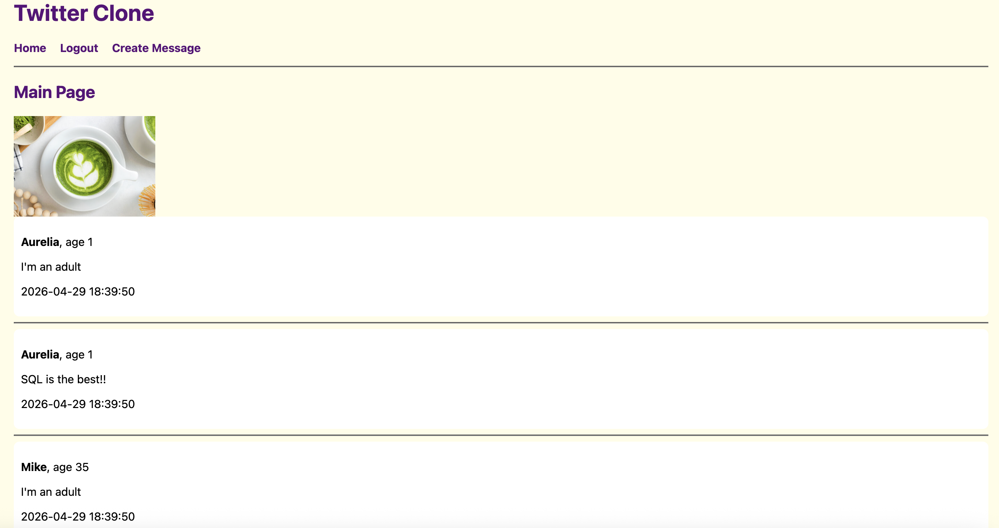

# Twitter Clone

This project functions similarly to Twitter, where users can create accounts, write messages, and view a real-time user feed.

This is a screenshot of the working home page.



## Features
- Create a user account
- Log in and out 
- Write and post a message 
- View all messages posted, sorted by most recent 
- Displays username, age, and time posted
- Styled with CSS and contains static images 

## How to Run the Tool: 

First, set up the virtual environment (if needed) and install dependencies:
```bash
python3 -m venv venv
source venv/bin/activate
pip install fastapi uvicorn jinja2
```

Then, create a database:
```bash
python3 db_create.py
```

Start the server: 
```bash
python3 main.py
```

Open link in browser:
```bash
http://127.0.0.1:8080
```

## Database Design 

### Users Table 
- id (primary key)
- username
- password
- age

### Messages Table 
- id integer (primary key)
- sender_id (foreign key → users.id)
- message
- created_at (timestamp)